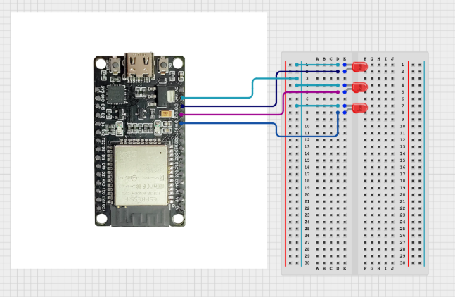

# 🎛️ ESP32 Async Web Server - LED Control Panel

A modern web-based control panel for ESP32 that allows you to control GPIO pins remotely through a beautiful, responsive web interface. Built with ESPAsyncWebServer and LittleFS for efficient file serving.


## ✨ Features

- 🌐 **Async Web Server** - Non-blocking web server for better performance
- 📱 **Responsive UI** - Beautiful gradient design that works on all devices
- 🔌 **GPIO Control** - Control up to 3 LEDs (GPIO 12, 13, 14)
- ⚡ **Real-time Updates** - Instant feedback on LED status
- 💾 **LittleFS Support** - Efficient file system for serving web pages
- 🎨 **Modern Interface** - Clean, gradient-based UI with smooth animations

## 📋 Prerequisites

Before you begin, ensure you have the following installed:

- [Visual Studio Code](https://code.visualstudio.com/)
- [Python](https://www.python.org/downloads/) (Version 3.6 or higher)
- USB drivers for ESP32 (usually CP2102 or CH340)

## 🚀 Setup Instructions

### Step 1: Install VS Code Extensions

1. Open **Visual Studio Code**
2. Click on the **Extensions** icon in the left sidebar (or press `Ctrl+Shift+X`)
3. Search for **"PlatformIO IDE"**
4. Click **Install** and wait for the installation to complete
5. Restart VS Code when prompted

### Step 2: Clone or Download the Project

**Option A: Using Git**
```bash
git clone <your-repository-url>
cd wifi-project
```

**Option B: Manual Download**
1. Download the project as a ZIP file
2. Extract it to your desired location
3. Open the folder in VS Code

### Step 3: Open Project in VS Code

1. Open **Visual Studio Code**
2. Click **File** → **Open Folder**
3. Navigate to the `wifi-project` folder and select it
4. Click **Select Folder**

### Step 4: Configure WiFi Credentials

1. Open `src/main.cpp`
2. Locate lines 7-8:
   ```cpp
   const char* ssid = "SHOIB";
   const char* password = "#Shoib777";
   ```
3. Replace with your WiFi credentials:
   ```cpp
   const char* ssid = "Your_WiFi_Name";
   const char* password = "Your_WiFi_Password";
   ```
4. Save the file (`Ctrl+S`)

### Step 5: Upload Filesystem (LittleFS)

1. Click on the **PlatformIO** icon in the left sidebar
2. Expand **PROJECT TASKS**
3. Expand **Platform** section
4. Click **Build Filesystem Image**
5. After building completes, click **Upload Filesystem Image**
6. Wait for the upload to complete (you'll see "SUCCESS" in the terminal)

### Step 6: Build and Upload Code

1. In the **PlatformIO** sidebar
2. Under **General** section, click **Build** (or press `Ctrl+Alt+B`)
3. After successful build, click **Upload** (or press `Ctrl+Alt+U`)
4. Wait for the upload to complete

### Step 7: Monitor Serial Output

1. In the **PlatformIO** sidebar
2. Click **Monitor** under **General** section (or press `Ctrl+Alt+S`)
3. Wait for the ESP32 to connect to WiFi
4. Note the **IP address** displayed in the serial monitor

### Step 8: Access the Web Interface

1. Open your web browser
2. Enter the IP address shown in the serial monitor (e.g., `http://192.168.1.100`)
3. You should see the ESP32 Control Panel
4. Toggle the switches to control the LEDs!

## 🔧 Hardware Setup

### Required Components

- ESP32 Development Board (DevKit v1 or compatible)
- 3x LEDs
- 3x 220Ω Resistors
- Breadboard
- Jumper wires
- USB cable

### Wiring Diagram



**Note:** Connect the positive leg (anode) of each LED to the GPIO pin and the negative leg (cathode) through a 220Ω resistor to GND.

## 📁 Project Structure

```
wifi-project/
│
├── src/
│   └── main.cpp              # Main Arduino code
│
├── data/
│   └── index.html            # Web interface (served via LittleFS)
│
├── include/
│   └── README                # Header files (if any)
│
├── lib/
│   └── README                # Custom libraries (if any)
│
├── test/
│   └── README                # Test files
│
└── platformio.ini            # PlatformIO configuration
```

## 🛠️ Configuration

### Customizing GPIO Pins

To use different GPIO pins, modify the pin definitions in `src/main.cpp`:

```cpp
#define led1 12  // Change to your desired pin
#define led2 13  // Change to your desired pin
#define led3 14  // Change to your desired pin
```

Also update the corresponding pin numbers in `data/index.html` in the `togglePin()` function calls.

### Changing Web Server Port

By default, the server runs on port 80. To change it, modify line 9 in `src/main.cpp`:

```cpp
AsyncWebServer server(80);  // Change 80 to your desired port
```

## 🐛 Troubleshooting

### ESP32 Not Connecting to WiFi
- Double-check your WiFi credentials
- Ensure your WiFi is 2.4GHz (ESP32 doesn't support 5GHz)
- Check if your network allows new devices to connect

### Upload Failed
- Make sure the correct COM port is selected
- Press and hold the BOOT button on ESP32 during upload
- Check if USB drivers are properly installed
- Try a different USB cable

### LittleFS Upload Failed
- Ensure the `data` folder exists in the project root
- Check that `index.html` is inside the `data` folder
- Try building the filesystem image again before uploading

### Web Page Not Loading
- Verify the ESP32 is connected to WiFi (check serial monitor)
- Make sure you uploaded the filesystem image
- Check that you're using the correct IP address
- Try accessing from a device on the same network

### PlatformIO Not Working
- Restart VS Code
- Rebuild the PlatformIO project: `Ctrl+Shift+P` → "PlatformIO: Rebuild"
- Check that Python is properly installed

## 📚 Dependencies

This project uses the following libraries (automatically installed by PlatformIO):

- **Arduino Framework** - Core ESP32 functions
- **WiFi** - WiFi connectivity
- **ESPAsyncWebServer** - Asynchronous web server
- **LittleFS** - File system for serving web pages

## 🎯 API Endpoints

### GET `/`
Returns the main web interface (index.html)

### GET `/led?id=<pin>&state=<state>`
Controls an LED on the specified GPIO pin

**Parameters:**
- `id` - GPIO pin number (12, 13, or 14)
- `state` - LED state (0 = OFF, 1 = ON)

**Example:**
```
http://192.168.1.100/led?id=12&state=1  // Turn ON LED 1
http://192.168.1.100/led?id=13&state=0  // Turn OFF LED 2
```

## 🔮 Future Enhancements

- [ ] Add more GPIO control options
- [ ] Implement sensor data display
- [ ] Add authentication/password protection
- [ ] OTA (Over-The-Air) updates
- [ ] PWM control for LED brightness
- [ ] Save states to EEPROM
- [ ] Mobile app integration

## 📄 License

This project is open source and available under the [MIT License](LICENSE).

## 🤝 Contributing

Contributions, issues, and feature requests are welcome! Feel free to check the issues page.

## 👨‍💻 Author

**Your Name**

- GitHub: [@Shob007](https://github.com/Shoib007)

## 🌟 Show Your Support

Give a ⭐️ if this project helped you!

## 📞 Support

If you have any questions or need help, feel free to:
- Open an issue on GitHub
- Contact me via email

---

**Happy Coding! 🚀**
